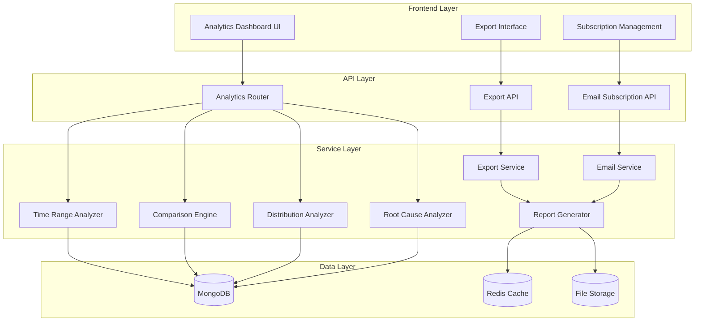

# Advanced Analytics Enhancements - Design Document

## Overview

This design document outlines the technical implementation for enhancing the existing analytics system with advanced time range analysis, comprehensive comparison capabilities, enhanced distribution statistics, root cause analysis tools, export functionality, and automated email reporting. The enhancements build upon the current solid foundation to provide enterprise-grade analytics capabilities.

The system currently provides basic analytics through the `/api/analytics/overview` endpoint with support for time ranges, browser/OS distribution, and basic comparisons. This enhancement will extend these capabilities significantly while maintaining backward compatibility and leveraging the existing MongoDB aggregation pipeline infrastructure.

## Architecture

### High-Level Architecture

The enhanced analytics system follows a modular architecture with clear separation of concerns:



### Component Architecture

The system extends the existing analytics infrastructure with new specialized components:

1. **Time Range Analyzer**: Handles advanced time period calculations and aggregations
2. **Comparison Engine**: Performs sophisticated period-over-period comparisons
3. **Distribution Analyzer**: Processes browser, OS, and geographic distribution data
4. **Root Cause Analyzer**: Identifies error patterns and provides actionable insights
5. **Export Service**: Generates PDF and Excel reports
6. **Email Subscription Service**: Manages automated report delivery
7. **Report Generator**: Creates formatted reports for various output formats

## Components and Interfaces

### 1. Time Range Analyzer

**Purpose**: Processes analytics data across different time periods with enhanced granularity.

**Interface**:
```javascript
class TimeRangeAnalyzer {
  async analyzeWeekly(projectFilter, startDate, endDate)
  async analyzeMonthly(projectFilter, startDate, endDate)
  async analyzeQuarterly(projectFilter, startDate, endDate)
  async analyzeAnnual(projectFilter, startDate, endDate)
  async getTimezoneSafeRange(range, timezone)
}
```

**Key Features**:
- Timezone-aware calculations
- Flexible aggregation periods (weekly, monthly, quarterly, annual)
- Optimized MongoDB aggregation pipelines
- Caching for frequently accessed ranges

### 2. Comparison Engine

**Purpose**: Performs advanced period-over-period comparisons with statistical analysis.

**Interface**:
```javascript
class ComparisonEngine {
  async compareMonthOverMonth(currentData, previousData)
  async compareYearOverYear(currentData, previousData)
  async calculateStatisticalSignificance(current, previous)
  async generateComparisonMetrics(current, previous, comparisonType)
}
```

**Key Features**:
- Month-over-month and year-over-year comparisons
- Statistical significance calculations
- Percentage change indicators with confidence intervals
- Handling of insufficient data scenarios

### 3. Distribution Analyzer

**Purpose**: Analyzes error distribution across browsers, operating systems, and geographic regions.

**Interface**:
```javascript
class DistributionAnalyzer {
  async getBrowserDistribution(projectFilter, dateRange, includeVersions = true)
  async getOSDistribution(projectFilter, dateRange, includeVersions = true)
  async getGeographicDistribution(projectFilter, dateRange)
  async getFilteredAnalytics(projectFilter, dateRange, filters)
}
```

**Key Features**:
- Enhanced browser/OS detection with version information
- Geographic distribution with interactive mapping data
- Cross-filtering capabilities
- Drill-down functionality for detailed analysis

### 4. Root Cause Analyzer

**Purpose**: Identifies error patterns and provides actionable insights for issue resolution.

**Interface**:
```javascript
class RootCauseAnalyzer {
  async getTopErrorsByFrequency(projectFilter, dateRange, limit = 10)
  async getTopErrorsByImpact(projectFilter, dateRange, limit = 10)
  async analyzeErrorPatterns(errorType, projectFilter, dateRange)
  async categorizeErrorsBySeverity(projectFilter, dateRange)
  async generateRemediationSuggestions(errorPattern)
}
```

**Key Features**:
- Frequency and impact-based error ranking
- Pattern recognition for related errors
- Severity categorization with business impact assessment
- Automated remediation suggestions
- Trend analysis for individual error types

### 5. Export Service

**Purpose**: Generates comprehensive reports in PDF and Excel formats.

**Interface**:
```javascript
class ExportService {
  async generatePDFReport(analyticsData, options)
  async generateExcelReport(analyticsData, options)
  async getExportProgress(exportId)
  async cleanupExpiredExports()
}
```

**Key Features**:
- Multi-format report generation (PDF, Excel)
- Progress tracking for long-running exports
- Embedded charts and visualizations
- Consistent branding and formatting
- Metadata inclusion (timestamps, filters, etc.)

### 6. Email Subscription Service

**Purpose**: Manages automated report delivery via email.

**Interface**:
```javascript
class EmailSubscriptionService {
  async createSubscription(userId, subscriptionConfig)
  async updateSubscription(subscriptionId, updates)
  async cancelSubscription(subscriptionId)
  async processScheduledReports()
  async retryFailedDeliveries()
}
```

**Key Features**:
- Flexible scheduling (daily, weekly, monthly)
- Customizable report content and time ranges
- Delivery retry mechanism with exponential backoff
- Subscription management with notifications
- Email-optimized report formatting

## Data Models

### Analytics Cache Model

```javascript
const analyticsCacheSchema = new mongoose.Schema({
  cacheKey: { type: String, required: true, unique: true, index: true },
  projectId: { type: mongoose.Schema.Types.ObjectId, ref: 'Project', index: true },
  dataType: { 
    type: String, 
    enum: ['overview', 'distribution', 'trends', 'rootcause'],
    index: true 
  },
  timeRange: {
    start: Date,
    end: Date,
    granularity: { type: String, enum: ['hour', 'day', 'week', 'month', 'quarter', 'year'] }
  },
  data: mongoose.Schema.Types.Mixed,
  expiresAt: { type: Date, index: { expireAfterSeconds: 0 } }
}, { timestamps: true });
```

### Email Subscription Model

```javascript
const emailSubscriptionSchema = new mongoose.Schema({
  userId: { type: mongoose.Schema.Types.ObjectId, ref: 'User', required: true, index: true },
  projectId: { type: mongoose.Schema.Types.ObjectId, ref: 'Project', index: true },
  name: { type: String, required: true },
  frequency: { 
    type: String, 
    enum: ['daily', 'weekly', 'monthly'], 
    required: true 
  },
  schedule: {
    time: String, // HH:MM format
    dayOfWeek: Number, // 0-6 for weekly
    dayOfMonth: Number // 1-31 for monthly
  },
  reportConfig: {
    timeRange: String,
    includeComparison: Boolean,
    sections: [String], // ['overview', 'trends', 'distribution', 'rootcause']
    format: { type: String, enum: ['html', 'pdf'], default: 'html' }
  },
  deliveryConfig: {
    recipients: [String], // email addresses
    subject: String,
    includeCharts: Boolean
  },
  status: { 
    type: String, 
    enum: ['active', 'paused', 'failed'], 
    default: 'active',
    index: true 
  },
  lastDelivery: Date,
  nextDelivery: { type: Date, index: true },
  failureCount: { type: Number, default: 0 },
  lastError: String
}, { timestamps: true });
```

### Export Job Model

```javascript
const exportJobSchema = new mongoose.Schema({
  userId: { type: mongoose.Schema.Types.ObjectId, ref: 'User', required: true, index: true },
  projectId: { type: mongoose.Schema.Types.ObjectId, ref: 'Project', index: true },
  type: { type: String, enum: ['pdf', 'excel'], required: true },
  status: { 
    type: String, 
    enum: ['pending', 'processing', 'completed', 'failed'], 
    default: 'pending',
    index: true 
  },
  progress: { type: Number, default: 0, min: 0, max: 100 },
  config: {
    timeRange: {
      start: Date,
      end: Date,
      preset: String
    },
    sections: [String],
    includeCharts: Boolean,
    includeRawData: Boolean
  },
  result: {
    filename: String,
    fileSize: Number,
    downloadUrl: String,
    expiresAt: Date
  },
  error: String,
  processingTime: Number
}, { timestamps: true });
```

## Correctness Properties

*A property is a characteristic or behavior that should hold true across all valid executions of a system-essentially, a formal statement about what the system should do. Properties serve as the bridge between human-readable specifications and machine-verifiable correctness guarantees.*

### Property 1: Time Range Aggregation Consistency

*For any* valid time range and aggregation period (weekly, monthly, quarterly, annual), the Time_Range_Analyzer should produce consistent aggregation buckets where the sum of all bucket values equals the total for the entire period.

**Validates: Requirements 1.1, 1.2, 1.3, 1.4**

### Property 2: Backward Compatibility Preservation

*For any* existing analytics API endpoint and parameter combination, the enhanced Analytics_System should return results that are structurally compatible with the previous system while potentially including additional fields.

**Validates: Requirements 1.5, 2.3, 4.3, 10.1, 10.3**

### Property 3: Performance Bounds

*For any* analytics request with dataset size up to 1 million records, the Analytics_System should complete processing within the specified time limits (3 seconds for dashboard load, 2 seconds for time range updates, 30 seconds for exports).

**Validates: Requirements 1.6, 5.4, 7.1, 7.4**

### Property 4: Timezone Calculation Correctness

*For any* valid timezone and time range combination, converting to the target timezone and back should preserve the logical time boundaries and duration of the original range.

**Validates: Requirements 1.7**

### Property 5: Comparison Calculation Accuracy

*For any* two comparable time periods with valid data, the Comparison_Engine should calculate percentage changes where ((current - previous) / previous) * 100 equals the reported change percentage within acceptable floating-point precision.

**Validates: Requirements 2.1, 2.2, 2.5**

### Property 6: Data Availability Handling

*For any* comparison request where insufficient historical data exists, the Analytics_System should gracefully handle the scenario by returning appropriate indicators rather than failing or returning incorrect calculations.

**Validates: Requirements 2.6, 8.5**

### Property 7: Distribution Analysis Completeness

*For any* error dataset, the sum of all browser/OS/geographic distribution counts should equal the total number of errors in the dataset, ensuring no data is lost or double-counted.

**Validates: Requirements 3.1, 3.2, 3.3**

### Property 8: Cross-Filter Consistency

*For any* applied filter (browser, OS, or region), all other analytics views should reflect the same filtered dataset, maintaining data consistency across the entire dashboard.

**Validates: Requirements 3.7, 9.3**

### Property 9: Root Cause Analysis Ranking

*For any* error dataset, the Root_Cause_Analyzer should rank errors such that frequency-based rankings are in descending order by count and impact-based rankings are in descending order by affected user count.

**Validates: Requirements 4.1, 4.2**

### Property 10: Export Content Completeness

*For any* dashboard state, exported reports (PDF or Excel) should contain all visible data and charts from the current dashboard view, with no information loss during the export process.

**Validates: Requirements 5.1, 5.2, 5.3, 5.6**

### Property 11: Report Format Consistency

*For any* report generation request, the Report_Generator should apply consistent branding, formatting, and metadata inclusion across all output formats and report types.

**Validates: Requirements 5.7, 6.5**

### Property 12: Subscription Delivery Reliability

*For any* active email subscription, the Email_Subscription_Service should attempt delivery at the scheduled time and implement retry logic for failed deliveries, ensuring eventual delivery or proper error logging.

**Validates: Requirements 6.4, 6.6**

### Property 13: Data Validation Completeness

*For any* analytics request, the Analytics_System should validate all input parameters and reject invalid requests with appropriate error messages before processing.

**Validates: Requirements 8.2, 9.7**

### Property 14: Cache Consistency

*For any* cached analytics data, the cache should expire within the specified time limit (5 minutes) and subsequent requests should return fresh data that reflects any changes in the underlying dataset.

**Validates: Requirements 7.3**

### Property 15: Internationalization Support

*For any* supported language (English or Chinese), all user interface elements, error messages, and generated reports should display text in the selected language without mixing languages or showing untranslated content.

**Validates: Requirements 9.6**

## Error Handling

### Error Categories and Handling Strategies

#### 1. Data Quality Errors
- **Missing Data**: Gracefully handle gaps in time series data by interpolating or clearly marking missing periods
- **Inconsistent Data**: Detect and log data discrepancies, use most recent valid data as fallback
- **Corrupted Data**: Validate data integrity during processing, skip corrupted records with logging

#### 2. Performance Errors
- **Timeout Errors**: Implement progressive loading and pagination for large datasets
- **Memory Errors**: Use streaming processing for large exports and analytics calculations
- **Concurrent Access**: Implement proper connection pooling and query optimization

#### 3. Integration Errors
- **Database Connection**: Implement connection retry logic with exponential backoff
- **Cache Failures**: Gracefully degrade to direct database queries when cache is unavailable
- **Email Delivery**: Implement retry mechanism with failure logging and user notification

#### 4. User Input Errors
- **Invalid Parameters**: Validate all inputs and provide clear error messages with suggested corrections
- **Authorization Errors**: Respect project access controls and provide appropriate feedback
- **Rate Limiting**: Implement request throttling with clear feedback to users

### Error Recovery Mechanisms

#### Automatic Recovery
- **Cache Regeneration**: Automatically rebuild cache when corruption is detected
- **Retry Logic**: Exponential backoff for transient failures (network, database)
- **Fallback Strategies**: Alternative data sources or simplified calculations when primary methods fail

#### Manual Recovery
- **Admin Tools**: Provide administrative interfaces for cache clearing and data repair
- **Export Recovery**: Allow users to retry failed export operations
- **Subscription Recovery**: Automatic reactivation of failed subscriptions after issue resolution

## Testing Strategy

### Dual Testing Approach

The testing strategy employs both unit testing and property-based testing to ensure comprehensive coverage:

**Unit Testing Focus**:
- Specific examples of time range calculations with known inputs/outputs
- Edge cases like timezone boundaries, daylight saving time transitions
- Integration points between analytics components
- Error conditions and recovery mechanisms
- UI component behavior and user interactions

**Property-Based Testing Focus**:
- Universal properties that hold across all valid inputs
- Data consistency across different aggregation periods
- Mathematical correctness of calculations and comparisons
- Performance characteristics under various load conditions
- Comprehensive input coverage through randomization

### Property-Based Testing Configuration

**Testing Framework**: fast-check (JavaScript/Node.js)
**Minimum Iterations**: 100 per property test
**Test Tagging**: Each property test must reference its design document property

**Tag Format**: `Feature: advanced-analytics-enhancements, Property {number}: {property_text}`

### Test Categories

#### 1. Data Processing Tests
- **Time Range Aggregation**: Verify correct bucketing and aggregation across all time periods
- **Comparison Calculations**: Validate mathematical accuracy of period-over-period comparisons
- **Distribution Analysis**: Ensure complete and accurate categorization of errors

#### 2. Performance Tests
- **Load Testing**: Verify response times under various dataset sizes
- **Concurrent Access**: Test system behavior with multiple simultaneous users
- **Memory Usage**: Monitor resource consumption during large operations

#### 3. Integration Tests
- **API Compatibility**: Ensure backward compatibility with existing endpoints
- **Database Operations**: Verify correct query execution and data retrieval
- **Cache Behavior**: Test cache invalidation and refresh mechanisms

#### 4. Export and Email Tests
- **Report Generation**: Verify completeness and accuracy of exported reports
- **Email Delivery**: Test subscription creation, modification, and delivery
- **Format Validation**: Ensure proper formatting across all output types

### Test Data Management

#### Synthetic Data Generation
- **Error Records**: Generate realistic error data with proper distributions
- **Time Series**: Create time-based data with various patterns and anomalies
- **User Scenarios**: Simulate different user access patterns and project configurations

#### Test Environment
- **Isolated Database**: Separate test database with controlled data sets
- **Mock Services**: Mock external dependencies (email, file storage)
- **Performance Monitoring**: Continuous monitoring of test execution times

The comprehensive testing approach ensures that the enhanced analytics system maintains reliability, performance, and accuracy while providing the new advanced features required by the business.